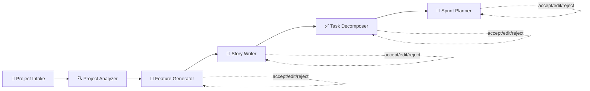
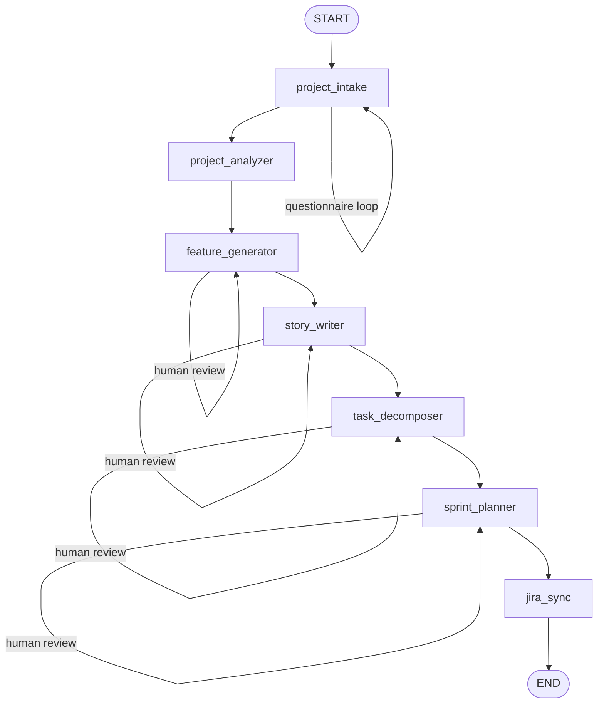

<div align="center">


# 📋 Scrum AI Agent

**AI-powered Scrum Master that decomposes projects into epics, stories, tasks, and sprint plans — right from your terminal.**

[](https://pypi.org/project/scrum-agent/)
[](https://python.org)
[](LICENSE)
[](https://anthropic.com)
[](https://langchain-ai.github.io/langgraph/)

[](https://github.com/omardin14/scrum-planning-ai-agent/actions)
[](https://pypi.org/project/scrum-agent/)

</div>

---

<div align="center">


*From project description to sprint plan in under a minute.*
</div>

---

## 🚀 Quick Start

### Recommended: uv or pipx

The most reliable way to install — pulls the full dependency tree from PyPI and isolates it in its own environment:

```bash
uv tool install scrum-agent     # or: pipx install scrum-agent
scrum-agent --setup             # configure your API key
scrum-agent                     # launch the interactive TUI
```

Optional extras (voice input, extra LLM providers) can be requested at install time:

```bash
uv tool install "scrum-agent[voice]"           # 🎤 dictate answers (double-tap Space) — offline, works with any LLM
uv tool install "scrum-agent[all-providers]"   # OpenAI, Google, and Bedrock providers
pipx install "scrum-agent[voice]"              # equivalent with pipx
```

> **Voice input** transcribes on-device with [faster-whisper](https://github.com/SYSTRAN/faster-whisper)
> — **no API key**, works with every LLM provider (Anthropic, Bedrock, …). On **macOS/Windows** the
> `[voice]` extra is fully self-contained (the `sounddevice` wheel bundles PortAudio). On **Linux**, also
> install the system library: `sudo apt install libportaudio2`. A small Whisper model downloads on first
> use (~140 MB for the default `base`; set `VOICE_MODEL` to `tiny`/`small`/`medium`/`large-v3` to trade
> size for accuracy).

> **Homebrew is not supported.** A required dependency (`sqlite-vec`) ships no
> source distribution, which Homebrew's source-build model can't handle, so
> `brew install scrum-agent` is intentionally disabled. Use `uv tool install`
> or `pipx install` above instead.

### From source

```bash
git clone https://github.com/omardin14/scrum-planning-ai-agent.git
cd scrum-planning-ai-agent
make install        # installs uv, creates venv, installs dependencies
make env            # creates .env from .env.example — add your API key
make run            # launch the CLI
```

### Headless / CI mode

```bash
scrum-agent --non-interactive --description "Build a todo app" --output json
scrum-agent --non-interactive --description @project-brief.txt --output html --team-size 5
```

---

## 📑 Table of Contents

- [Quick Start](#-quick-start)
- [Features](#-features)
- [Getting Started](#-getting-started)
- [Deploy on AWS Lightsail](#-deploy-on-aws-lightsail-openclaw)
- [CLI Reference](#%EF%B8%8F-cli-reference)
- [Intake Modes](#-intake-modes)
- [Pipeline](#-pipeline)
- [Team Analysis Mode](#-team-analysis-mode)
- [Analysis-Calibrated Planning](#-analysis-calibrated-planning)
- [Export Formats](#-export-formats)
- [Session Management](#-session-management)
- [Usage Page](#-usage-page)
- [Settings Page](#%EF%B8%8F-settings-page)
- [Tools](#-tools)
- [Architecture](#%EF%B8%8F-architecture)
- [Project Intake Questionnaire](#-project-intake-questionnaire)
- [Scrum Standards](#-scrum-standards)
- [Prompt Construction](#-prompt-construction)
- [Guardrails](#%EF%B8%8F-guardrails)
- [Multi-Provider LLM Support](#-multi-provider-llm-support)
- [Development](#%EF%B8%8F-development)
- [Evaluation & Testing](#-evaluation--testing)
- [Tech Stack](#%EF%B8%8F-tech-stack)
- [Agentic Blueprint Reference](#-agentic-blueprint-reference)
- [License](#-license)

---

## ✨ Features

🖥️ **Full-screen TUI** — Animated splash, mode selection with ASCII art titles, pipeline progress with spinners and elapsed time, dark/light themes

🧠 **Smart Intake** — Extracts answers from your description, asks only what's missing, adaptive follow-ups with question-specific probes

🔄 **Human-in-the-Loop** — Accept, edit, or reject at every pipeline stage with numbered review menus

📊 **Capacity Planning** — Bank holidays (100+ countries), PTO/leave tracking, unplanned absence %, onboarding ramp-up, per-sprint velocity

🔌 **30 Tools** — GitHub, Azure DevOps, Jira, Confluence, local codebase scanning, bank holiday detection, LLM-powered estimation

📤 **5 Export Formats** — Markdown, HTML, JSON, Jira sync, Azure DevOps Boards sync

🤖 **4 LLM Providers** — Claude (default), GPT, Gemini, AWS Bedrock

💾 **Session Persistence** — SQLite-backed sessions that survive terminal restarts; resume with `--resume`

🛡️ **Guardrails** — Input validation (injection, profanity, relevance), output validation (story format, AC coverage, sprint capacity)

🏷️ **Task Enrichment** — Auto-tagged labels (Code/Docs/Infra/Testing), test plans, AI coding prompts for Cursor/Claude Code/Copilot

📝 **Offline Questionnaire** — Export a blank template, fill in at your own pace, import to skip interactive flow

📄 **SCRUM.md Context** — Drop a `SCRUM.md` in your project directory; the agent reads it to pre-fill answers and ground output

☀️ **Daily Standup** — Detects team activity (Jira/AzDO/GitHub/Confluence/git), infers per-person updates or takes your own, scores sprint-day confidence, and delivers to terminal/desktop/Slack/email — on an OS schedule that runs even when the app is closed

🔬 **Team Analysis Mode** — Connect your Jira or Azure DevOps board to analyze your team's real patterns: velocity, sprint cadence, story structure, acceptance criteria style, naming conventions, and per-developer breakdown

🎯 **Analysis-Calibrated Planning** — Select a team analysis profile when planning and the agent auto-fills intake questions, matches your team's story/task counts, enforces your AC format, uses your Definition of Done, and shows calibration banners at every pipeline stage

👥 **Team Member Selection** — Pick specific developers from your analysis profile for a project; velocity is calculated from their individual averages, not the whole team total

📊 **Usage Dashboard** — Track token consumption per session, per provider, and lifetime totals with a dedicated usage page

🎵 **Focus Music** — Optional background music via [cliamp](https://github.com/bjarneo/cliamp): `Ctrl+P` play/pause, `Ctrl+O` to switch channel, from any screen. Auto-pauses while you dictate a voice note

---

## 🏁 Getting Started

### Prerequisites

- Python 3.11+
- An API key for at least one LLM provider:
  - [Anthropic](https://console.anthropic.com/settings/keys) (recommended)
  - [OpenAI](https://platform.openai.com/api-keys)
  - [Google AI Studio](https://aistudio.google.com/app/apikey)
  - [AWS Bedrock](https://aws.amazon.com/bedrock/) (IAM credentials — no API key needed on EC2/Lightsail)

### Installation (development)

```bash
make install        # installs uv, creates venv, installs dependencies
make env            # creates .env from .env.example
make pre-commit     # installs pre-commit hooks
```

### First-run setup wizard

On first launch (or with `--setup`), an interactive wizard walks you through:

1. **LLM provider selection** — choose Anthropic, OpenAI, Google, or AWS Bedrock
2. **API key entry** — with format validation hints (e.g., Anthropic keys start with `sk-ant-`)
3. **Issue tracking** — Jira or Azure DevOps Boards (with org URL, project, and PAT verification)
4. **Version control** — GitHub PAT token (or skip)
5. **Credential storage** — saved to `~/.scrum-agent/.env`

```bash
scrum-agent --setup   # re-run anytime to update credentials
```

### API keys

#### Anthropic (default)

```
ANTHROPIC_API_KEY=sk-ant-...
```

#### OpenAI (alternative)

```
LLM_PROVIDER=openai
OPENAI_API_KEY=sk-...
```

#### Google (alternative)

```
LLM_PROVIDER=google
GOOGLE_API_KEY=AIza...
```

<details>
<summary>🔍 LangSmith (optional tracing)</summary>

[LangSmith](https://smith.langchain.com/) provides tracing and observability. Add to `.env`:

```
LANGSMITH_TRACING=true
LANGSMITH_API_KEY=lsv2_pt_...
LANGSMITH_PROJECT=scrum-agent
```

</details>

---

<details>
<summary>☁️ Deploy on AWS Lightsail (OpenClaw) — 14 steps</summary>

## ☁️ Deploy on AWS Lightsail (OpenClaw)

Run scrum-agent as a cloud service via [OpenClaw](https://aws.amazon.com/lightsail/openclaw/) on AWS Lightsail. OpenClaw comes pre-installed on the Lightsail blueprint and uses Amazon Bedrock (Claude Sonnet 4.6) as its model provider.

### 1. Create the instance

1. Open the [AWS Lightsail console](https://lightsail.aws.amazon.com/)
2. **Create instance** → choose the **OpenClaw** blueprint under "Apps + OS"
3. Select your region (e.g., `eu-west-2`) and instance plan (2 GB RAM minimum recommended)
4. Name the instance (e.g., `OpenClaw-1`) and create it


### 2. Attach a static IP

Your public IP changes on every stop/start. Attach a static IP in the Lightsail **Networking** tab to keep it stable.


### 3. Enable Bedrock access

OpenClaw uses Amazon Bedrock as its default AI model provider. Grant Bedrock API access by running the setup script in **AWS CloudShell**:

```bash
curl -s https://d25b4yjpexuuj4.cloudfront.net/scripts/lightsail/setup-lightsail-openclaw-bedrock-role.sh \
  | bash -s -- OpenClaw-1 eu-west-2
```

Replace `OpenClaw-1` with your instance name and `eu-west-2` with your region.

> **Note:** If this is your first time using Anthropic models in Amazon Bedrock, you'll need to complete the [First Time Use (FTU) form](https://console.aws.amazon.com/bedrock/home#/modelaccess) to gain access.


### 4. Pair your browser

1. Click **Connect using SSH** in the Lightsail console (or use your own SSH client)
2. Follow the on-screen instructions to pair your browser with the OpenClaw dashboard
3. Click **Open dashboard** to access the OpenClaw web UI


### 5. Install scrum-agent on the instance

SSH into the instance and install scrum-agent with Bedrock support:

```bash
# Install pipx if not present
sudo apt update && sudo apt install -y pipx
pipx ensurepath
source ~/.bashrc   # reload PATH so pipx-installed binaries are found

# Install scrum-agent with Bedrock provider
pipx install "scrum-agent[bedrock]"
```

> **Tip:** If `scrum-agent: command not found` after install, run `source ~/.bashrc` (or start a new SSH session) to pick up the updated PATH.


### 6. Run the setup wizard

```bash
scrum-agent --setup
```

1. Select **Bedrock** as your LLM provider
2. The AWS region is auto-detected from `~/.aws/config` (e.g., `eu-west-2`) — press Enter to confirm
3. The wizard verifies Bedrock access using the IAM role attached by the Bedrock setup script — no API key needed
4. If OpenClaw is installed, the Bedrock model ID (e.g., `global.anthropic.claude-sonnet-4-6`) is auto-detected and saved to `~/.scrum-agent/.env`


### 7. Test headless mode

Verify scrum-agent works end-to-end before installing the skill:

```bash
scrum-agent --non-interactive --description "Build a todo app" --output json
```

You should see JSON output with features, stories, tasks, and sprints.


### 8. Install the OpenClaw skill

The `scrum-planner` skill lets OpenClaw conduct conversational scrum planning — it asks intake questions (or skips them in quick mode), generates a temp SCRUM.md, invokes `scrum-agent --non-interactive --output json`, and presents results phase-by-phase with accept/edit/regenerate options.

> **Tip:** After every `pipx install --force` (e.g., updating to a new version), re-run `scrum-agent --install-skill` to update the skill files and refresh the configuration.

A single command handles the full setup:

```bash
scrum-agent --install-skill
```

This will:
1. Copy the skill files to the skills registry at `/usr/lib/node_modules/openclaw/skills/scrum-planner/` (may prompt for sudo)
2. Copy the skill files into the sandbox workspace at `~/.openclaw/workspace/skills/scrum-planner/`
3. Sync the Bedrock model ID and region from OpenClaw's config into `~/.scrum-agent/.env`
4. Disable the Docker sandbox so `scrum-agent` runs directly on the host
5. Restart the OpenClaw gateway to load the new skill

```
[1/5] Skill registry: /usr/lib/node_modules/openclaw/skills/scrum-planner
[2/5] Sandbox workspace: /home/ubuntu/.openclaw/workspace/skills/scrum-planner
[3/5] Bedrock config synced: model=global.anthropic.claude-sonnet-4-6, region=eu-west-2
[4/5] Sandbox disabled — scrum-agent will run on host
[5/5] Restart OpenClaw gateway to load the skill? [Y/n]
```

> **Security note:** This disables OpenClaw's Docker sandbox isolation, meaning tools execute directly on the host. This is safe for dedicated Lightsail instances running only the scrum-planner skill. For shared or multi-tenant setups, consider building a [custom sandbox image](https://docs.openclaw.ai/gateway/sandboxing) with Python pre-installed instead.

To install to a custom skills directory:

```bash
scrum-agent --install-skill /path/to/openclaw/skills
```


### 9. Verify the skill is loaded

Open the OpenClaw dashboard and check the **Skills** page. You should see `scrum-planner` listed under **Installed Skills** with an "eligible" badge.


### 10. Test the skill

Start a new conversation in the OpenClaw dashboard or Slack. Try a detailed project:

> "Plan an e-commerce marketplace — React + Next.js frontend, Python FastAPI backend, PostgreSQL, Redis, Stripe for payments, Auth0 for auth. 4 engineers, 2-week sprints. Deployed on AWS ECS."

You should see:
1. **Smart extraction** — the skill detects project, tech stack, team size, integrations from your message
2. **Follow-up questions** — only asks what's missing (project type, definition of done, target sprints)
3. **Confirmation summary** — your answers + defaults, with option to override
4. **TUI recommendation** — for complex projects (3+ features, 5+ engineers), the skill suggests installing the full TUI via `uv tool install scrum-agent` or `pipx install scrum-agent` for interactive editing, sprint visualisation, and capacity planning. This is informational only — generation always proceeds.
5. **Background generation** — progress updates as each phase completes (~3-5 minutes)
6. **Phase-by-phase review** — features, stories, tasks, sprint plan — each with accept/edit/regenerate

For a faster test, try quick mode:

> "just plan it — todo app, FastAPI + PostgreSQL, 1 engineer"


### 11. Troubleshooting

If the skill doesn't appear in the dashboard:

```bash
# Re-install and restart
scrum-agent --install-skill
```

If `scrum-agent` fails inside the skill:

```bash
# Test headless mode directly
scrum-agent --non-interactive --description "Build a todo app" --team-size 3 --sprint-length 2 --output json

# Check logs
ls -lt ~/.scrum-agent/logs/ | head -5
tail -50 ~/.scrum-agent/logs/*.log

# Check credentials
grep LLM_PROVIDER ~/.scrum-agent/.env
```

### 12. Connect Slack (optional)

Connect OpenClaw to your Slack workspace so users can trigger the scrum-planner skill via `@mention`.

#### Quick setup (interactive)

```bash
openclaw channels add
```

Follow the interactive prompts — OpenClaw walks you through each step.

#### Manual setup

If you prefer to set up the Slack App manually:

1. Go to [Slack API → Create App](https://api.slack.com/apps) → **From manifest** and paste the JSON below
2. **Socket Mode** → Enable it → copy the **App-Level Token** (`xapp-...`)
3. **Install App** to your workspace → copy the **Bot Token** (`xoxb-...`)
4. **Event Subscriptions** → already configured via the manifest (socket mode)
5. **App Home** → Messages tab is enabled for DMs

<details>
<summary>Slack App manifest (click to expand)</summary>

```json
{
  "display_information": {
    "name": "OpenClaw",
    "description": "OpenClaw connector"
  },
  "features": {
    "bot_user": {
      "display_name": "OpenClaw",
      "always_online": false
    },
    "app_home": {
      "messages_tab_enabled": true,
      "messages_tab_read_only_enabled": false
    },
    "slash_commands": [
      {
        "command": "/openclaw",
        "description": "Send a message to OpenClaw",
        "should_escape": false
      }
    ]
  },
  "oauth_config": {
    "scopes": {
      "bot": [
        "chat:write",
        "channels:history",
        "channels:read",
        "groups:history",
        "im:history",
        "mpim:history",
        "users:read",
        "app_mentions:read",
        "reactions:read",
        "reactions:write",
        "pins:read",
        "pins:write",
        "emoji:read",
        "commands",
        "files:read",
        "files:write",
        "canvases:read",
        "canvases:write"
      ]
    }
  },
  "settings": {
    "socket_mode_enabled": true,
    "event_subscriptions": {
      "bot_events": [
        "app_mention",
        "message.channels",
        "message.groups",
        "message.im",
        "message.mpim",
        "reaction_added",
        "reaction_removed",
        "member_joined_channel",
        "member_left_channel",
        "channel_rename",
        "pin_added",
        "pin_removed"
      ]
    }
  }
}
```

</details>

> **Important:** The manifest includes `canvases:read` and `canvases:write` scopes. These are required for OpenClaw to post the finalized sprint plan as a Slack Canvas. Without them, the plan will be posted as threaded messages instead (which also works, but Canvas gives a better reading experience for large plans).

Set the tokens on the Lightsail instance:

```bash
openclaw channels add
# When prompted, enter:
#   App-Level Token: xapp-...
#   Bot Token: xoxb-...
```


### 13. Use the skill in Slack

Once Slack is connected, `@mention` the bot in a channel to invite it. Send a casual first message to establish the thread — the bot's first reply won't appear in a thread, so keep it simple:


> **You:** @OpenClaw hey, how's it going?


Then start your planning session in a **new message** (this one will create a proper thread):

> **You:** @OpenClaw Plan a mobile banking app — React Native, Node.js, PostgreSQL, 6 engineers

The skill runs the same conversational intake as the dashboard, directly in a Slack thread:

1. **Smart extraction** — the bot detects answers from your initial message and shows what it found
2. **Follow-up questions** — numbered choices for project type, sprint length, and target sprints
3. **Adaptive probes** — "You said 6 engineers — what are their roles?"
4. **Confirmation** — summary list with answer sources and defaults before generating

After confirmation, the bot runs `scrum-agent` in the background (~3-5 minutes), then presents results phase-by-phase with accept/edit/regenerate options.


### 14. Next steps

- **Push to Jira** — Configure Jira credentials in `scrum-agent --setup`, then the skill offers "Push to Jira" after plan finalization.
- **Customize the skill** — Edit `~/.openclaw/workspace/skills/scrum-planner/SKILL.md` to adjust question flow, add domain-specific defaults, or change the output format.
- **Review diagnostics** — Check `~/.scrum-agent/logs/` for detailed run logs if anything looks off.
- **Secure with Teleport** — For production use, add Teleport for identity-aware access to the Lightsail instance and OpenClaw dashboard.

See [`skills/scrum-planner/README.md`](skills/scrum-planner/README.md) for full skill documentation, question-to-CLI mapping, and troubleshooting.

</details>

---

## ⌨️ CLI Reference

```
scrum-agent [OPTIONS]
```

### Interactive modes

| Flag | Description |
|------|-------------|
| _(no flags)_ | Launch the full-screen TUI with mode selection |
| `--quick` | Quick intake — 2 questions only (team size + tech stack), auto-fill rest |
| `--full-intake` | Full 30-question intake (standard mode) |
| `--mode project-planning` | Skip the startup menu, go directly to project planning |
| `--questionnaire PATH` | Import a filled-in questionnaire Markdown file |
| `--export-only` | Auto-accept all review checkpoints and exit after plan generation |

### Non-interactive / headless

| Flag | Description |
|------|-------------|
| `--non-interactive` | Run headlessly (requires `--description`) |
| `--description TEXT` | Project description. Use `@file.txt` to read from a file |
| `--output {markdown,json,html}` | Output format (default: markdown). Only valid with `--non-interactive` or `--export-only` |
| `--team-size N` | Team size (maps to intake Q6) |
| `--sprint-length {1,2,3,4}` | Sprint length in weeks (maps to intake Q8) |

### Daily Standup

| Flag | Description |
|------|-------------|
| `--standup-run` | Run a daily standup headlessly and deliver it (what the OS scheduler invokes) |
| `--standup-interactive` | With `--standup-run`: prompt for your update + confirm (timed) before generating; falls back to headless with no TTY |
| `--standup-session ID` | Session to run the standup for (default: most recent) |
| `--standup-output {terminal,desktop,slack,email,all}` | Override the session's saved delivery channels |

### Session management

| Flag | Description |
|------|-------------|
| `--resume [ID]` | Resume a session. No argument = interactive picker. `latest` = most recent. Or pass a session ID |
| `--list-sessions` | List all saved sessions and exit |
| `--clear-sessions` | Interactively delete saved sessions |

### Configuration

| Flag | Description |
|------|-------------|
| `--setup` | Re-run the first-time setup wizard |
| `--theme {dark,light}` | Terminal colour theme (default: dark) |
| `--no-bell` | Disable terminal bell after pipeline steps |
| `--dry-run` | Run TUI with mock data and fake delays — no LLM calls |
| `--version` | Print version and exit |

### Questionnaire export

| Flag | Description |
|------|-------------|
| `--export-questionnaire [PATH]` | Export a blank questionnaire template as Markdown |

### 🎵 Music (cliamp)

Play focus music while you plan. This is an **optional** integration with
[cliamp](https://github.com/bjarneo/cliamp), a standalone terminal music player — install it
separately (`brew install bjarneo/cliamp/cliamp`, or `go install github.com/bjarneo/cliamp@latest`).
If the `cliamp` binary isn't on your `PATH`, the feature is disabled — the status bar shows a dim
`♪ music: brew install bjarneo/cliamp/cliamp` hint and the controls are no-ops until you install it.

Once installed, a compact player status appears on the bottom border of **every** screen, and two
control chords work app-wide — even while typing in a text field:

| Key | Action |
|-----|--------|
| `Ctrl+P` | Play / pause (starts the current channel when stopped) |
| `Ctrl+O` | Switch to the next channel (Lofi → Jazz → Classical → Ambient) |

Music **auto-pauses while you record a voice note** (double-tap Space) and resumes when the
recording ends, so it never bleeds into your dictation. The on/off state and selected channel are
remembered between runs. Under the hood, playback runs as a headless `cliamp --daemon` process that
is stopped automatically when you exit.

<details>
<summary>💻 In-session commands</summary>

These commands are available at the `scrum>` prompt during an interactive session:

| Command | Description |
|---------|-------------|
| `help`, `?` | Show available commands |
| `skip` | Skip the current intake question (uses a sensible default) |
| `defaults` | Apply defaults for all remaining questions in the current phase |
| `export` | Export current artifacts as HTML report + Markdown |
| `/compact` | Switch to compact output (hide secondary columns) |
| `/verbose` | Switch to verbose output (full detail, default) |
| `/resume` | Load a previously saved session |
| `/clear` | Delete saved sessions (pick one or all) |
| `Q6: answer` | Edit Q6 inline from the summary |
| `edit Q6` | Re-answer Q6 interactively from the summary |
| `exit`, `quit` | Exit the agent |
| `Ctrl+C`, `Ctrl+D` | Exit the agent |

The **status bar** at the bottom of the terminal shows project name, current phase, and session info. It updates automatically as you progress through the pipeline.

</details>

<details>
<summary>📝 Examples</summary>

```bash
scrum-agent                                            # interactive TUI (recommended)
scrum-agent --quick                                    # quick intake (2 questions only)
scrum-agent --full-intake                              # full 30-question intake
scrum-agent --questionnaire intake.md                  # import pre-filled questionnaire
scrum-agent --export-only --quick                      # non-interactive, auto-accept all
scrum-agent --resume                                   # resume last session (picker)
scrum-agent --resume latest                            # resume most recent session
scrum-agent --list-sessions                            # list all saved sessions
scrum-agent --clear-sessions                           # delete saved sessions
scrum-agent --non-interactive --description "Build X"  # headless mode
scrum-agent --non-interactive --description @brief.txt --output json  # JSON to stdout
scrum-agent --dry-run                                  # TUI with mock data
```

</details>

---

## 🎯 Intake Modes

The agent supports four intake modes, each balancing thoroughness with speed.

### Smart mode (default)

The recommended mode. The agent:

1. Reads your initial project description and extracts answers to as many questions as possible
2. **When an analysis profile is selected**, auto-fills team size, sprint length, velocity, tech stack, and integrations from real data
3. Asks only the remaining essential questions (typically 2–4)
4. Uses **answer provenance tracking** to tag how each answer was obtained:
   - `DIRECT` — you explicitly answered
   - `EXTRACTED` — parsed from your initial description
   - `DEFAULTED` — filled with a sensible default
   - `PROBED` — filled via a targeted follow-up question
   - `SCRUM_MD` — loaded from a `SCRUM.md` file in the current directory
5. Applies **conditional essentials** — questions that only appear when relevant (e.g., "What are their roles?" only asked after you give a team size)
6. Runs **cross-question validation** — catches contradictions (e.g., team size of 1 but multiple roles listed)
7. Generates **adaptive follow-ups** using question-specific templates (not generic "tell me more")
8. Accepts **"any" / "no preference"** for tech stack (Q11) and **"none"** for integrations (Q12) without triggering follow-up probes

### Quick mode (`--quick`)

Two questions only: team size and tech stack. Everything else gets sensible defaults. Best for rapid prototyping or CI pipelines.

### Standard mode (`--full-intake`)

Six questions are rendered as numbered selection menus instead of free text:

| Q | Topic | Options |
|---|-------|---------|
| Q2 | Project type | Greenfield / Existing codebase / Hybrid |
| Q8 | Sprint length | 1 week / 2 weeks *(default)* / 3 weeks / 4 weeks |
| Q16 | Code hosting | GitHub / Azure DevOps / GitLab / Bitbucket / Local |
| Q18 | Repo structure | Monorepo / Multi-repo / Microservices / Monolith |
| Q24 | Estimation style | Fibonacci points / T-shirt sizes / No estimates |
| Q26 | Output format | Jira / Markdown / Both |

Type `defaults` at any question to batch-accept all defaults for the current phase and skip ahead.

All 30 questions asked one-at-a-time in a conversational flow. Seven phases:

1. **Project Context** (Q1–Q5) — name, type, goals, users, deadlines
2. **Team & Capacity** (Q6–Q10) — engineers, roles, sprint length, velocity, target sprints
3. **Technical Context** (Q11–Q14) — tech stack, integrations, constraints, docs
4. **Codebase Context** (Q15–Q20) — repo, structure, CI/CD, tech debt
5. **Risks & Unknowns** (Q21–Q23) — risks, blockers, out-of-scope
6. **Preferences** (Q24–Q26) — estimation, DoD, output format
7. **Capacity Planning** (Q27–Q30) — sprint selection, bank holidays, unplanned absence %, onboarding

### Offline import (`--questionnaire`)

1. Export a blank template: `scrum-agent --export-questionnaire`
2. Fill it in at your own pace in any editor
3. Import: `scrum-agent --questionnaire intake.md`
4. Review the summary and confirm before proceeding

The format is round-trippable (export → edit → import preserves answers exactly).

<details>
<summary>📄 SCRUM.md context</summary>

Drop a `SCRUM.md` file in your project directory with any relevant context — project notes, design decisions, URLs, architecture diagrams. The agent reads it automatically and uses it to pre-fill answers and ground its output. Answers extracted from SCRUM.md are tagged with `*(from SCRUM.md)*` provenance markers in the intake summary. Your typed description always takes priority over SCRUM.md when both provide the same information.

</details>

<details>
<summary>📁 scrum-docs/ directory</summary>

Place PRDs, design docs, or reference material in a `scrum-docs/` directory. Supported formats: `.md`, `.txt`, `.rst`, `.pdf`. PDF support requires the `pymupdf` optional dependency:

```bash
uv sync --extra pdf
```

Files are automatically ingested and fed into the project analyzer for grounded output.

</details>

---

## 🔄 Pipeline

After intake confirmation, the agent runs a 5-stage pipeline with a human-in-the-loop checkpoint after each stage:



| Stage | What it does |
|-------|-------------|
| **Project Analyzer** | Synthesizes all 30 intake answers into a structured `ProjectAnalysis` — name, type, goals, tech stack, constraints, risks, out-of-scope |
| **Feature Generator** | Decomposes the analysis into high-level features with priorities (Critical/High/Medium/Low) |
| **Story Writer** | Breaks features into user stories with persona/goal/benefit format, Given/When/Then acceptance criteria, Fibonacci story points (1–8, auto-split if >8), discipline tagging, and Definition of Done flags |
| **Task Decomposer** | Breaks stories into concrete tasks with labels (Code/Documentation/Infrastructure/Testing), test plans, and AI coding prompts. Auto-generates documentation sub-tasks for stories with Documentation in their DoD |
| **Sprint Planner** | Allocates stories to sprints respecting per-sprint net velocity (deducted for bank holidays, PTO, unplanned absence, onboarding, KTLO). Handles capacity overflow with 3 options: extend sprints, increase team, or keep as-is |

At each checkpoint, you can:
- **`[1] Accept`** — proceed to the next stage
- **`[2] Edit`** — modify specific artifacts inline
- **`[3] Reject`** — re-generate with your feedback

### Task enrichment

Every task generated by the Task Decomposer includes:

| Field | Description |
|-------|-------------|
| **Label** | Auto-tagged: `Code`, `Documentation`, `Infrastructure`, or `Testing` — colour-coded in all views |
| **Test plan** | Auto-generated for Code and Infrastructure tasks — lists what to test (unit, integration, edge cases) |
| **AI prompt** | ARC-structured instruction for Cursor/Claude Code/Copilot, including project name, tech stack, and specific guidance |

Stories with "Documentation" marked as applicable in their DoD get a consolidated documentation sub-task referencing Confluence/README URLs from intake.

<details>
<summary>🔹 Small project handling</summary>

For projects with ≤2 sprints and ≤3 goals, the analyzer sets `skip_epics`. Instead of multi-epic decomposition, a single sentinel epic is created using the project name as its title. The rest of the pipeline (stories, tasks, sprints) proceeds normally.

</details>

<details>
<summary>📊 Prompt quality rating</summary>

After intake, the analysis review screen shows a deterministic quality rating:

- **Letter grade** (A/B/C/D) with percentage score
- **Breakdown**: answered, extracted, defaulted, skipped, probed counts
- **Actionable suggestions**: "Add a SCRUM.md file", "Answer Q11 (tech stack) for better stories", etc.
- **Low-confidence areas**: defaulted essential questions flagged for downstream spike recommendations

</details>

---

## ☀️ Daily Standup

A first-class TUI mode (peer to Analysis and Planning) that runs your team's daily scrum — detecting what everyone did since the last standup, estimating sprint progress, and delivering a summary. It can run **on a schedule even when scrum-agent is closed**, so a 09:50 standup lands before your 10:00 call.

Open it from the mode-selection screen (the magenta **Standup** card) or run it headlessly with `--standup-run`.

### What it does

1. **Detects recent activity** across every configured source — Jira issues, Azure DevOps work items, GitHub commits + PRs, recently-updated Confluence pages, and a local git log. Each source is best-effort: an unconfigured or failing source is skipped, never fatal. An **authentication failure (401/403) surfaces as a Notice**, not silence.
2. **Asks for your own update first**, then infers everyone else. Press **Generate** and it prompts for your update (Enter to skip); people without a self-report get an inferred summary from a single LLM call.
3. **Computes sprint day + confidence** deterministically (no LLM): which working day of the sprint you're on (weekends and bank holidays excluded), and how actual "Done" points compare to the ideal linear burn-down → **On track / At risk / Behind**.
4. **Delivers** the summary to any combination of **terminal, desktop notification, Slack, and email**.
5. **Never shows blank content** — if the LLM has no API key or a source returns 401/403, a **⚠ Notices** section tells you exactly what to fix.

### Scheduling (runs when the app is closed)

Press **Configure** on the Standup page to set the **standup time** (e.g. `10:00`), how many **minutes early** to run (default 10), weekdays, and delivery channels. You enter when the meeting *happens* — the job fires a few minutes before (10:00 → runs 09:50), so the summary lands before you start.

Enabling a schedule installs an **OS-native job** — a `launchd` agent on macOS (`~/Library/LaunchAgents/`) or a `crontab` entry on Linux. On macOS it **opens a Terminal** at run time and gives you a short, timed window to type your update and confirm (auto-proceeds if you don't respond); on a headless Linux run it just generates and delivers. Under the hood the job runs:

```bash
scrum-agent --standup-run --standup-interactive --standup-session <id>
```

No background daemon is kept alive; the operating system fires the job, so it works even with scrum-agent fully quit and survives reboots.

### Delivery configuration

Non-secret settings (time, channels) live per-session in SQLite. Secrets/creds go in `~/.scrum-agent/.env` (see `.env.example`):

- **Slack** — `SLACK_WEBHOOK_URL` (an [incoming webhook](https://api.slack.com/messaging/webhooks))
- **Email** — `STANDUP_SMTP_HOST/PORT/USER/PASSWORD`, `STANDUP_SMTP_SENDER`, `STANDUP_EMAIL_RECIPIENTS`
- **GitHub activity** — `STANDUP_GITHUB_REPO` (owner/repo)
- **Desktop / Terminal** — no configuration required

Everything uses the Python standard library (Slack via `urllib`, email via `smtplib`, desktop via `osascript`/`notify-send`) — **no new dependencies**.

### Exports

Every standup — generated in the TUI, run headlessly, or fired on a schedule — is auto-saved as **Markdown and self-contained HTML** under `~/.scrum-agent/exports/standup/<project>/` (dated `standup-YYYY-MM-DD.md` / `.html`), so the output is a shareable document rather than something you reconstruct from logs. The **Export** button on the page re-writes the latest report on demand, just like the Analysis and Planning pages.

### Try it

```bash
scrum-agent                                                   # open the Standup card, press Generate
scrum-agent --standup-run --standup-session latest --standup-output terminal
```

Standup runs are logged to `~/.scrum-agent/logs/standup/`, exported to `~/.scrum-agent/exports/standup/`, and persisted to the `standup_history` table.

---

## 🔬 Team Analysis Mode

Team Analysis connects to your Jira or Azure DevOps board and produces a comprehensive analysis of your team's real delivery patterns. The analysis becomes a reusable **profile** that calibrates future planning sessions.

<div align="center">

</div>

### What gets analyzed

| Category | Details |
|----------|---------|
| **Velocity** | Per-sprint velocity, team average, per-developer breakdown with delivery vs KTLO split |
| **Sprint Cadence** | Sprint length, seasonal patterns, velocity trends over time |
| **Story Structure** | Average stories per epic, story point distribution, typical story size |
| **Task Patterns** | Average tasks per story, type distribution (Development %, Testing %, Deploy %) |
| **Acceptance Criteria** | AC count per story, writing style (Given/When/Then vs flexible), coverage patterns |
| **Definition of Done** | Team's actual DoD items extracted from completed stories |
| **Naming Conventions** | Epic naming style (quarter-scoped, feature-based), ticket organization patterns |
| **Team Members** | Per-contributor analysis with velocity, discipline (backend/frontend/etc.), stories completed, sprint participation |
| **Estimation Bias** | Whether the team tends to over- or under-estimate |
| **Board Workflow** | Column workflow analysis showing how work items flow through states |

### How it works

1. **Select a board** — pick your Jira project or Azure DevOps team board
2. **Choose sprint scope** — analyze last 3, 5, 10, or all sprints
3. **Review the analysis** — 6-page walkthrough: Instructions, Sample Epic, Sample Stories, Sample Tasks, Sample Sprint Plan, Analysis Report
4. **Save as a profile** — stored in SQLite, reusable across planning sessions


### Per-developer breakdown

Each team member gets individual analysis:

<div align="center">

</div>

| Metric | Description |
|--------|-------------|
| **Velocity** | Individual points per sprint average |
| **Discipline** | Primary skill area (backend, frontend, fullstack, infrastructure, etc.) — LLM-classified from actual work |
| **Stories completed** | Total stories delivered in the analysis window |
| **Sprint participation** | Number of sprints active |
| **Delivery vs KTLO** | Split between feature delivery and keeping-the-lights-on work |

### Analysis exports

Analysis results can be exported as HTML or Markdown reports. Both formats include all analysis sections plus a Team Members table. When an analysis profile is used during planning, the export includes a provenance note linking back to the analysis.

---

## 🎯 Analysis-Calibrated Planning

When you start a planning session, you can select a saved analysis profile. This calibrates the entire planning pipeline to match your team's real patterns.

<div align="center">

</div>

### Intake auto-fill

The analysis profile auto-fills intake questions so you don't have to answer them manually:

| Question | Source |
|----------|--------|
| **Q6 — Team size** | Replaced with a team member multi-select picker showing each developer's velocity and discipline |
| **Q7 — Team roles** | Auto-filled from selected members' disciplines |
| **Q8 — Sprint length** | Derived from sprint date ranges in the analysis |
| **Q9 — Velocity** | Calculated from selected team members' individual per-sprint averages |
| **Q11 — Tech stack** | Auto-filled from the analysis profile's tech stack (shown as suggestion, user can override) |
| **Q12 — Integrations** | Auto-filled from the analysis profile's integrations list |
| **Q27 — Sprint selection** | Falls back to analysis sprint data when live tracker is unavailable |

<div align="center">

</div>

### Team member multi-select

When an analysis profile has contributor data, Q6 (team size) becomes a multi-select picker instead of a free-text number:

<div align="center">

</div>

- Each member shows their velocity (pts/sprint) and discipline
- Select specific developers for this project with Space, confirm with Enter
- Velocity is calculated from the selected members' individual averages
- Team roles (Q7) auto-populated from selected members' disciplines

### Calibration banners

Each pipeline stage shows a calibration banner explaining what analysis data influenced the output:

<div align="center">

</div>

| Stage | Banner shows |
|-------|-------------|
| **Project Analyzer** | Selected profile name and source board |
| **Story Writer** | Target stories/epic, AC count, points scale, DoD source |
| **Task Decomposer** | Target tasks/story, type distribution (Dev/Test/Deploy %) |
| **Sprint Planner** | Selected team members with individual velocities, total team velocity |

### What gets calibrated

| Artifact | Calibration |
|----------|-------------|
| **Epics** | LLM-reformatted to match team's naming convention (quarter-scoped, feature-based, etc.) and template sections |
| **Stories per feature** | Matches team's historical average stories per epic |
| **AC count** | Enforces team's median acceptance criteria count per story |
| **AC format** | Respects team's writing style (Given/When/Then or flexible) |
| **Definition of Done** | Uses team's actual DoD items instead of generic checklist |
| **Story points** | Includes confidence scoring and references to similar stories from the analysis |
| **Tasks per story** | Matches team's average task count |
| **Task type distribution** | Matches team's Development/Testing/Deploy percentages |

### Epic review

Before the feature generator runs, an **epic review page** lets you review and edit the project epic. When an analysis profile is active, the epic is LLM-reformatted to match your team's style:

<div align="center">

</div>

- Quarter-scoped naming when the team uses that convention (e.g., "Q2 2026 — Customer Portal")
- Template sections matching the team's epic structure
- Sync to Jira or Azure DevOps directly from the review page

---

## 📤 Export Formats

### Markdown (default)

Writes `scrum-plan.md` with all artifacts structured as headings, tables, and lists.

```bash
scrum-agent --export-only --quick
```

### HTML

Self-contained single-file HTML report with embedded CSS, collapsible sections, and a table of contents. No external dependencies.

```bash
scrum-agent --non-interactive --description "Build a todo app" --output html
```

### JSON

Clean, pipeable JSON schema for CI/CD integration. No internal state fields — just the plan artifacts:

```json
{
  "version": "1.0.0",
  "project": { "name", "description", "type", "goals", "tech_stack", "team_size", "sprint_length_weeks" },
  "features": [...],
  "stories": [...],
  "tasks": [...],
  "sprints": [...]
}
```

```bash
scrum-agent --non-interactive --description "Build a todo app" --output json | jq '.stories | length'
```

When using `--output json`, Rich console output goes to stderr so stdout is clean JSON.

### Jira

Batch sync with idempotent creation, available from TUI pipeline review at any stage or from the project list:

| Artifact | Jira Mapping |
|----------|-------------|
| **Features** | Jira Labels (not separate issues) |
| **Epic** | 1 project-level Epic |
| **Stories** | Issues linked to Epic, with story points, priority, acceptance criteria, feature labels |
| **Tasks** | Sub-tasks linked to parent Stories, with task labels |
| **Sprints** | Created with name, goal, dates; stories assigned to sprints |

Key behaviors:
- **Idempotency** — checks `jira_*_keys` state before creating; skips already-synced artifacts
- **Cascade creation** — Task stage auto-creates Stories if not yet synced; Sprint stage auto-creates Stories if not yet synced
- **Project type detection** — discovers issue types dynamically (handles team-managed vs. classic Jira projects)
- **Confirmation screen** — shows what will be created/skipped before any write operation
- **Progress screen** — animated per-item status during creation
- **Jira button** — disabled/dimmed in TUI when `JIRA_API_TOKEN` is not configured


<details>
<summary>🔷 Azure DevOps Boards</summary>

### Azure DevOps Boards

Batch sync with idempotent creation, available from TUI pipeline review at any stage:

| Artifact | Azure DevOps Mapping |
|----------|---------------------|
| **Features** | Tags (`System.Tags`, semicolon-separated) |
| **Epic** | 1 project-level Epic work item |
| **Stories** | User Story work items linked to Epic via `System.LinkTypes.Hierarchy-Reverse`, with story points, priority (1–4), HTML descriptions |
| **Tasks** | Task work items linked to parent Stories |
| **Sprints** | Iterations (classification nodes created via REST API); stories assigned via `System.IterationPath` |

Key behaviors:
- **Idempotency** — checks `azdevops_*_keys` state before creating; skips already-synced artifacts
- **Cascade creation** — Task stage auto-creates Stories if not yet synced; Iteration stage auto-creates Stories if not yet synced
- **Team area path** — sets `System.AreaPath` to `{project}\{team}` so work items appear on the correct team board
- **Description updates on re-sync** — already-created items get descriptions updated (DoD, rationale, AI prompts added later)
- **Sprint naming convention** — detects board's existing iteration naming pattern and renames LLM-generated names to match
- **Iteration dates** — sets start/finish dates on iterations based on sprint start date and sprint length
- **Velocity auto-detection** — fetches velocity from past iterations during intake (falls back from Jira to AzDO)
- **HTML descriptions** — acceptance criteria, Definition of Done, and points rationale rendered as `<h3>`, `<strong>`, `<ul><li>` (not Jira wiki markup)
- **Priority mapping** — `critical → 1`, `high → 2`, `medium → 3`, `low → 4`
- **Confirmation screen** — shows what will be created/skipped before any write operation
- **Progress screen** — animated per-item status during creation
- **Azure DevOps button** — disabled/dimmed in TUI when credentials are not configured

#### PAT permissions required

Create a [Personal Access Token](https://learn.microsoft.com/en-us/azure/devops/organizations/accounts/use-personal-access-tokens-to-authenticate) with the following scopes:

| Scope | Access | Used for |
|-------|--------|----------|
| **Work Items** | Read & Write | Reading board/backlog, creating Epics/Stories/Tasks |
| **Project and Team** | Read | Listing iterations, team settings, velocity data |
| **Code** | Read | Reading repo file tree and file contents (optional, for repo context tools) |

```
AZURE_DEVOPS_TOKEN=your-pat-token
AZURE_DEVOPS_ORG_URL=https://dev.azure.com/your-org
AZURE_DEVOPS_PROJECT=MyProject
AZURE_DEVOPS_TEAM=MyProject Team    # optional — defaults to "{project} Team"
```

</details>

---

## 💾 Session Management

Sessions are persisted to SQLite at `~/.scrum-agent/data/sessions.db`. Every terminal session gets a unique ID (`new-<8hex>-<YYYY-MM-DD>`) and a human-readable display name derived from the project slug (`todoapp-2026-03-19`). Team analysis profiles are stored in the same database.

### Directory structure

```
~/.scrum-agent/
  data/
    sessions.db         # SQLite — planning sessions, analysis profiles, token usage
  exports/
    analysis/           # HTML + Markdown analysis reports
    planning/           # HTML + Markdown planning exports
  logs/
    tui/                # TUI application logs (rotates at 2 MB)
    analysis/           # Per-analysis session logs
    planning/           # Per-planning session logs
  .env                  # API keys and credentials
```

### Resume a session

```bash
scrum-agent --resume            # interactive picker
scrum-agent --resume latest     # most recent session
scrum-agent --resume <id>       # specific session ID
```

Resumed sessions pick up exactly where you left off — mid-questionnaire, mid-review, or between pipeline stages.

### List sessions

```bash
scrum-agent --list-sessions
```

Shows a table with project name, date, last completed step, and session ID.

### Delete sessions

```bash
scrum-agent --clear-sessions
```

Interactive picker to delete one session or clear all.

### Auto-pruning

Sessions older than 30 days are auto-pruned at startup. Configure via `SESSION_PRUNE_DAYS` in `.env` (set to `0` to disable).

---

## 📊 Usage Page

The Usage page tracks token consumption across all sessions, accessible from the main menu.

<div align="center">

</div>

| Metric | Description |
|--------|-------------|
| **Session tokens** | Input and output tokens for the current session |
| **Lifetime tokens** | Cumulative total across all sessions, persisted in SQLite |
| **Per-provider breakdown** | Tokens split by LLM provider (Anthropic, OpenAI, Google, Bedrock) |
| **Session history** | Recent sessions with their token counts and timestamps |
| **Cost estimate** | Approximate cost based on provider pricing |

Token usage is tracked automatically via `track_usage()` on every LLM call and persisted to the `token_usage` table in SQLite. The page uses a dedicated amber colour theme to distinguish it from Planning (blue) and Analysis (green).

---

## ⚙️ Settings Page

The Settings page provides a read-only view of your current configuration and a shortcut to the setup wizard.

<div align="center">

</div>

| Section | What it shows |
|---------|---------------|
| **LLM Provider** | Active provider and model (e.g., Anthropic / claude-sonnet-4) |
| **API Keys** | Configured keys with values masked (e.g., `sk-ant-***...***abc`) |
| **Issue Tracking** | Jira and/or Azure DevOps connection status, org URL, project |
| **Version Control** | GitHub token status |
| **Paths** | Database location, export directories, log directories |

From the Settings page you can launch the **setup wizard** to reconfigure providers, API keys, and integrations. The page uses a grey colour theme.

---

## 🔧 Tools

The agent has access to 30 tools, organized by integration:

<details>
<summary>🐙 GitHub (4 tools)</summary>

| Tool | Description |
|------|-------------|
| `github_read_repo` | Fetch repo metadata, languages, and file tree |
| `github_read_file` | Read a single file from a GitHub repo |
| `github_list_issues` | List open issues with labels |
| `github_read_readme` | Extract README content |

</details>

<details>
<summary>🔷 Azure DevOps (9 tools)</summary>

| Tool | Description | Risk |
|------|-------------|------|
| `azdevops_read_repo` | Fetch repo metadata and file tree | Low |
| `azdevops_read_file` | Read a single file from a repo | Low |
| `azdevops_list_work_items` | List work items (backlog, active, etc.) | Low |
| `azdevops_read_board` | Board info, active iteration, average velocity | Low |
| `azdevops_fetch_velocity` | Team velocity, team size, per-developer velocity | Low |
| `azdevops_fetch_active_iteration` | Current sprint name, number, start date | Low |
| `azdevops_create_epic` | Create an Epic work item | High (requires confirmation) |
| `azdevops_create_story` | Create a User Story linked to Epic, with story points and priority | High (requires confirmation) |
| `azdevops_create_iteration` | Create an iteration (sprint) with optional start/finish dates | High (requires confirmation) |

</details>

<details>
<summary>🎫 Jira (6 tools)</summary>

| Tool | Description | Risk |
|------|-------------|------|
| `jira_read_board` | Fetch board metadata and configuration | Low |
| `jira_fetch_velocity` | Get team velocity history (rolling average of last 3–5 sprints, with JQL fallback for team-managed boards) | Low |
| `jira_fetch_active_sprint` | Get current sprint info for sprint selection (Q27) | Low |
| `jira_create_epic` | Create an epic | High (requires confirmation) |
| `jira_create_story` | Create a story with ACs and story points | High (requires confirmation) |
| `jira_create_sprint` | Create and configure a sprint | High (requires confirmation) |

</details>

<details>
<summary>📚 Confluence (5 tools)</summary>

| Tool | Description | Risk |
|------|-------------|------|
| `confluence_search_docs` | Search documentation by keyword | Low |
| `confluence_read_page` | Read a wiki page by ID | Low |
| `confluence_read_space` | Read space metadata and page list | Low |
| `confluence_create_page` | Create a new page | High (requires confirmation) |
| `confluence_update_page` | Update an existing page | High (requires confirmation) |

</details>

<details>
<summary>💻 Local codebase (3 tools)</summary>

| Tool | Description |
|------|-------------|
| `read_codebase` | Scan entire local repo — language detection, file tree (budget-limited, auto-collapses large dirs), skips binaries and build artifacts |
| `read_local_file` | Read a specific file from disk (targeted retrieval when the LLM needs to inspect particular files) |
| `load_project_context` | High-level codebase overview including `scrum-docs/` PRD/design doc ingestion |

</details>

<details>
<summary>📅 Calendar (1 tool)</summary>

| Tool | Description |
|------|-------------|
| `detect_bank_holidays` | Detect public holidays in the planning window (auto-fills Q28) |

</details>

<details>
<summary>🤖 LLM-powered (2 tools)</summary>

| Tool | Description |
|------|-------------|
| `estimate_complexity` | Analyze code/requirements for story point estimation |
| `generate_acceptance_criteria` | Generate Given/When/Then acceptance criteria |

</details>

### Tool risk levels

| Risk | Guardrail |
|------|-----------|
| **Low** (read-only) | Auto-execute |
| **Medium** (LLM-powered) | Log and display to user |
| **High** (write operations) | Requires explicit user confirmation |

---

## 🏗️ Architecture

### Four Layers

| Layer | Implementation |
|-------|---------------|
| **Interface** | Full-screen TUI with animated splash, mode selection, session editor, pipeline progress, streaming output, and dark/light themes |
| **Prompt Construction** | Scrum Master persona, ARC-structured prompts per node, few-shot examples, adaptive question templates |
| **Model** | Anthropic Claude (primary), OpenAI GPT, Google Gemini — swappable via `LLM_PROVIDER` env var |
| **Data & Storage** | SQLite session store (`~/.scrum-agent/data/sessions.db`) with team analysis profiles, token usage tracking, optional Jira/Confluence/Azure DevOps integration |

### Three Design Principles

1. **Robust Infrastructure** — agent frameworks (LangChain, LangGraph), graceful rate-limit retry with exponential backoff, crash-safe session persistence
2. **Modularity** — decoupled CLI/TUI/REPL/agent/tools/prompts, one concern per module, UI system with 4 subsystems
3. **Continuous Evaluation** — golden dataset evaluators, contract tests with VCR cassettes, token budget monitoring

### Agent Graph (LangGraph)

Auto-generated via `make graph`:




### Node Descriptions

| Node | Responsibility |
|------|---------------|
| **Project Intake** | Runs the discovery questionnaire (smart/standard/quick mode) to gather all project context |
| **Project Analyzer** | Synthesizes questionnaire answers into a structured `ProjectAnalysis` with name, type, goals, tech stack, constraints, and risks |
| **Feature Generator** | Decomposes the analysis into high-level features with priority levels. For small projects (≤2 sprints, ≤3 goals), creates a single sentinel epic instead |
| **Story Writer** | Breaks features into user stories with persona/goal/benefit, short titles, Given/When/Then acceptance criteria, Fibonacci story points (auto-split >8), discipline tagging, DoD flags, and points rationale |
| **Task Decomposer** | Breaks stories into concrete tasks with auto-tagged labels (Code/Documentation/Infrastructure/Testing), test plans for code tasks, AI coding prompts, and dedicated documentation sub-tasks |
| **Sprint Planner** | Allocates stories to sprints using per-sprint net velocity (bank holidays, PTO, unplanned %, onboarding, KTLO deducted). Handles capacity overflow with 3 options. Highlights impacted sprints |
| **Jira Sync** | Pushes the finalized plan to Jira with idempotent batch creation: Features → Labels, Stories → linked to Epic, Tasks → Sub-tasks, Sprints → created and assigned |

<details>
<summary>🔁 The ReAct Loop</summary>

The foundational reasoning pattern:

```
Thought → Action → Observation → (repeat until done)
```

1. **Thought** — reason about the current state and what to do next
2. **Action** — call a tool or take a step
3. **Observation** — see the result, decide whether to continue or answer

</details>

<details>
<summary>🖥️ TUI System</summary>

The `ui/` package provides a full-screen terminal UI with four subsystems:

| Subsystem | Purpose |
|-----------|---------|
| `mode_select/` | Full-screen mode selection with ASCII art titles, project cards with pipeline progress indicators, project list with half-card peek stubs at viewport edges. Includes Analysis, Planning, Usage, and Settings pages |
| `provider_select/` | LLM and tool provider selection (block-character logos for Claude/GPT/Gemini), issue tracking setup, verification flow |
| `session/` | Main session UI — description input, intake questions, summary review, pipeline stages with artifact editing, epic review, calibration banners, Jira/Azure DevOps export, chat. Dry-run mode with mock data |
| `shared/` | Animations (typewriter, pulse), ASCII font rendering, reusable components (Theme, buttons, scrollbar, progress dots, viewport), mouse scroll handling |

Visual features:
- **Rounded borders** with consistent padding and arrow-key navigation
- **Sticky group headers** — epic titles pin at top when scrolling, with decryption-style morph animation between sections
- **Scrollbar** — vertical `│` track with `┃` thumb for pipeline stages and summary review
- **Capacity bars** — per-sprint with reduced velocity for bank-holiday/PTO-impacted sprints (amber border + annotations)
- **Project cards** — one-shot white pulse animation on Enter, pipeline progress badges

The `repl/` package is the legacy REPL kept for backwards compatibility and CLI-flag-driven flows (`--quick`, `--full-intake`, `--questionnaire`, `--mode`).

</details>

<details>
<summary>📦 State Schema</summary>

- **ScrumState** is a `TypedDict` (LangGraph convention for graph state)
- `messages` uses `Annotated[list[BaseMessage], add_messages]` for append semantics
- **Frozen dataclasses** for artifacts — `Feature`, `UserStory`, `Task`, `Sprint`, `ProjectAnalysis` (immutable once created, serializable via `asdict()`)
- **Mutable dataclass** for `QuestionnaireState` — updated incrementally by the intake node
- Artifact lists use `Annotated[list[...], operator.add]` so nodes can return items that get appended

</details>

<details>
<summary>🏷️ Agent Classification</summary>

| Property | Value |
|----------|-------|
| **Agency Level** | Level 3–4 (self-looping + multi-agent coordination) |
| **Reasoning Pattern** | ReAct (Thought → Action → Observation → repeat) |
| **Interface** | Terminal CLI (full-screen TUI + legacy REPL) |
| **Domain** | Scrum project management |

</details>

---

<details>
<summary>📝 Project Intake Questionnaire — 30 questions across 7 phases</summary>

## 📝 Project Intake Questionnaire

Before generating any Scrum artifacts, the agent runs a structured discovery phase — asking the user questions **one at a time** in a conversational flow. This is the "flipped prompt" technique: the agent gathers what it needs before it acts.

### Questionnaire Flow

The agent asks these questions sequentially. Each question is asked individually, the user responds, and the agent moves to the next. The agent adapts follow-up questions based on previous answers.

#### Phase 1 — Project Context

| # | Question | Why the Agent Needs This |
|---|----------|-------------------------|
| 1 | **What is the project?** Describe it in a few sentences, or point me to a repo/doc. | Establishes the core scope and domain |
| 2 | **Is this a greenfield project or are you building on an existing codebase?** | Determines whether the agent should scan existing code, and whether there's legacy complexity |
| 3 | **What problem does this project solve? Who are the end users?** | Grounds epic/story generation in real user needs rather than abstract features |
| 4 | **What does "done" look like? What's the end-state you're targeting?** | Defines the finish line — prevents scope creep and gives the agent a clear goal to decompose toward |
| 5 | **Are there any hard deadlines or milestones?** | Constrains the sprint plan; the agent needs to know if time is fixed |

#### Phase 2 — Team & Capacity

| # | Question | Why the Agent Needs This |
|---|----------|-------------------------|
| 6 | **How many engineers are working on this?** | Directly affects sprint capacity and parallelism of work |
| 7 | **What are the roles on the team?** (e.g., 2 backend, 1 frontend, 1 fullstack) | Lets the agent tag stories by discipline and balance sprint workload across skillsets |
| 8 | **How long are your sprints?** (e.g., 1 week, 2 weeks) | Required for sprint planning — determines how many points fit per sprint |
| 9 | **Do you have a known velocity from previous sprints?** If yes, what is it? | If available, the agent uses real velocity; otherwise it defaults to **5 points per engineer per sprint** |
| 10 | **How many sprints are you targeting to complete this project?** | Bounds the total effort and forces prioritization if scope exceeds capacity |

#### Phase 3 — Technical Context

| # | Question | Why the Agent Needs This |
|---|----------|-------------------------|
| 11 | **What is the tech stack?** (languages, frameworks, databases, infra) | Stories and tasks need to be written in terms the team actually works with |
| 12 | **Are there any existing APIs, services, or third-party integrations involved?** | Identifies external dependencies that create stories of their own (auth, payments, etc.) |
| 13 | **Are there any architectural constraints or decisions already made?** (e.g., must use microservices, must deploy to AWS) | Prevents the agent from suggesting work that contradicts fixed decisions |
| 14 | **Is there any existing documentation, PRDs, or design docs I should reference?** | The agent can ingest these for grounded story generation |

#### Phase 3a — Codebase Context

| # | Question | Why the Agent Needs This |
|---|----------|-------------------------|
| 15 | **Does the project have an existing codebase, or is this a new build?** | Determines whether the agent needs to account for existing code, migrations, and legacy constraints |
| 16 | **Where is the code hosted?** (GitHub, Azure DevOps, GitLab, Bitbucket, local only) | Tells the agent which source control tool to use for repo scanning |
| 17 | **Can you share the repo URL(s)?** (the agent can connect and scan the repo for context) | Enables the agent to read repo structure, key files, and README to ground its output |
| 18 | **How is the repo structured?** (monorepo, multi-repo, microservices, monolith) | Affects how the agent decomposes work |
| 19 | **Is there an existing CI/CD pipeline or deployment setup?** | Identifies whether DevOps stories are needed |
| 20 | **Is there any known technical debt?** (legacy code, outdated dependencies, areas needing refactoring) | Surfaces refactoring stories and constraints |

#### Phase 4 — Risks & Unknowns

| # | Question | Why the Agent Needs This |
|---|----------|-------------------------|
| 21 | **Are there any areas of the project you're uncertain or worried about?** | The agent flags these as spike stories or high-risk items |
| 22 | **Are there any known blockers or dependencies on external teams/systems?** | Creates blocked/dependency stories and affects sprint ordering |
| 23 | **Is there anything that's explicitly out of scope?** | Prevents generating stories for work the team won't do |

#### Phase 5 — Preferences & Process

| # | Question | Why the Agent Needs This |
|---|----------|-------------------------|
| 24 | **How do you want stories estimated?** (Fibonacci story points, T-shirt sizes, or no estimates) | Configures the output format |
| 25 | **Do you have a Definition of Done the team follows?** | Incorporated into acceptance criteria validation |
| 26 | **Do you want the output pushed to Jira, exported as Markdown, or both?** | Determines the final step of the pipeline |

#### Phase 6 — Capacity Planning

| # | Question | Why the Agent Needs This |
|---|----------|-------------------------|
| 27 | **Which sprint are you planning for?** | Anchors the planning window. Auto-detected from Jira active sprint if configured; otherwise presented as a choice question |
| 28 | **How many bank holidays fall within your planning window?** | Deducts from gross capacity. Auto-detected via `detect_bank_holidays` tool (100+ countries, 3-layer locale fallback: Jira timezone → shell locale → GB default). User can override |
| 29 | **What percentage of capacity is typically lost to unplanned absences?** (default: 10%) | Real feature capacity is ~24% of gross after all deductions (based on analysis of capacity planning templates) |
| 30 | **Are any engineers currently onboarding or ramping up?** | Reduces individual capacity during ramp-up sprints |

After Q28 (bank holidays), the agent asks about **planned leave (PTO)**:
- Per-person entry with name, start date, and end date (DD/MM/YYYY format with validation)
- Dates outside the planning window are rejected
- Working-day calculation excludes weekends
- Summary shown after each entry with option to add more
- Quick mode skips PTO (defaults to 0)

### Adaptive Behavior

The questionnaire is not rigid — the agent adapts:

- **Skips questions the user already answered.** If your initial description included "we're a team of 4 using React and Node", the agent won't re-ask team size or tech stack.
- **Extracts answers from descriptions.** Keyword matching detects project type (greenfield/existing), integrations (Stripe, Auth0), and infrastructure constraints (Kubernetes, microservices).
- **Uses conditional essentials.** Q7 (team roles) only appears if Q6 (team size) was answered. Q12 (integrations) only if Q11 (tech stack) was answered.
- **Asks targeted follow-ups.** Instead of generic "tell me more", the agent uses question-specific probing templates.
- **Validates across questions.** Catches contradictions — e.g., team size of 1 but multiple roles listed.
- **Adapts question text.** "You said **5 engineers** — what are their roles?" instead of static text.
- **Allows "skip" and "I don't know".** Proceeds with reasonable defaults and flags assumptions.
- **Summarizes before proceeding.** After all questions, presents a structured summary for confirmation.

### Intake Summary Output

After the questionnaire, the agent produces a structured summary:

```
Here's what I understand about your project:

  Project:        E-commerce platform redesign
  Type:           Existing codebase (monolith → microservices migration)
  End Users:      Online shoppers, internal warehouse staff
  Target State:   Fully migrated to microservices with new checkout flow

  Team:           5 engineers (2 backend, 2 frontend, 1 devops)
  Sprint Length:  2 weeks
  Velocity:       25 pts/sprint (default: 5 × 5 engineers, no historical data)
  Target Sprints: 6 sprints (12 weeks)

  Tech Stack:     Python/FastAPI, React, PostgreSQL, AWS ECS
  Integrations:   Stripe (payments), SendGrid (email), existing REST API
  Constraints:    Must maintain backward compat with mobile app v2.x

  Risks:
    - Payment flow migration (high complexity, Stripe webhook changes)
    - No clear spec for warehouse dashboard requirements

  Out of Scope:   Mobile app redesign, analytics pipeline

  Output:         Jira + Markdown export

  Does this look right? [Confirm / Edit]
```

Only after the user confirms does the agent proceed to feature generation.

</details>

---

<details>
<summary>📏 Scrum Standards — Issue hierarchy, story format, acceptance criteria, DoD</summary>

## 📏 Scrum Standards

These are the team's codified practices. The agent enforces all of these when generating and validating Scrum artifacts.

### 1. Issue Hierarchy

| Level | What It Represents | Scope | Example |
|-------|--------------------|-------|---------|
| **Epic** | A large body of work representing the big picture. Can span months or multiple sprints. | The **Why** of the project | _"Customer Self-Service Portal"_ |
| **Feature** | A significant piece of functionality that contributes to the big picture. Can span multiple sprints. | The **What** we're building | _"Subscription Management"_ |
| **User Story** | A smaller, well-defined unit of work. Must be completable within a single sprint. | The **How** of the project | _"As a customer, I want to upgrade my plan"_ |
| **Sub-Task** | A breakdown of a story into manageable, assignable parts. | Implementation detail | _"Add upgrade endpoint to billing API"_ |
| **Spike** | A time-boxed research task to reduce uncertainty before delivery work begins. | Learning & discovery | _"Investigate Stripe webhook reliability"_ |

### 2. User Stories

#### Format

User stories follow this structure:

> **"As a [persona], I want to [goal], so that [benefit]."**

#### Breaking It Down

| Part | What It Means | Guidance |
|------|--------------|----------|
| **As a [persona]** | Who are we building this for? Not a job title — a real persona the team understands with empathy. | The team should have a shared understanding of this person — how they work, think, and feel. |
| **I want to [goal]** | What is the user actually trying to achieve? Describes intent, not features. | Must be implementation-free. If you're describing UI elements instead of the user's goal, you're missing the point. |
| **So that [benefit]** | How does this fit into their bigger picture? What problem does it solve? | Ties the story back to real value and helps define when the story is truly done. |

#### Examples

- _As Max, I want to invite my friends, so we can enjoy this service together._
- _As Sascha, I want to organise my work, so I can feel more in control._
- _As a manager, I want to understand my colleagues' progress, so I can better report our successes and failures._

#### Story Point Rules

| Rule | Detail |
|------|--------|
| **Scale** | Fibonacci: 1, 2, 3, 5, 8 |
| **Maximum** | 8 points per story. If estimated above 8, the story **must** be split. |
| **What points measure** | Relative complexity and effort, not hours. |
| **Default velocity** | When no historical data exists: **5 points per engineer per sprint**. |
| **Sprint capacity** | Stories are allocated to sprints without exceeding capacity (`engineers x 5` or known velocity). |

**Velocity Calculation Examples:**

| Scenario | Calculation | Sprint Capacity |
|----------|------------|-----------------|
| 3 engineers, no known velocity | 3 × 5 | 15 pts/sprint |
| 5 engineers, no known velocity | 5 × 5 | 25 pts/sprint |
| 4 engineers, known velocity of 30 | Use 30 directly | 30 pts/sprint |

**Auto-Split Example:**

If the agent estimates "Build the full payment integration" at 13 points:

```
This story exceeds the 8-point maximum. Splitting:

  Original: Build the full payment integration (13 pts)

  Split into:
    US-010: Set up Stripe SDK and payment intent flow    (5 pts)
    US-011: Build webhook handler for payment events      (5 pts)
    US-012: Add payment error handling and retry logic    (3 pts)

  Total: 13 pts across 3 stories (all ≤ 8)

  [Accept split / Edit / Reject]?
```

#### Discipline Tagging

Every story is tagged with the primary discipline needed:

| Discipline | Description |
|-----------|-------------|
| `frontend` | UI/UX implementation |
| `backend` | API, business logic, data |
| `fullstack` | Spans both (default fallback) |
| `infrastructure` | DevOps, CI/CD, deployment |
| `design` | UX research, visual design |
| `testing` | QA, test automation |

#### Story Checklist

Before a story is considered ready for sprint planning, it must have:

- [ ] Clear persona identified
- [ ] Goal is implementation-free and user-focused
- [ ] Benefit ties to real business or user value
- [ ] Acceptance criteria written (see Acceptance Criteria)
- [ ] Story points estimated (1–8 range)
- [ ] Dependencies identified and linked
- [ ] Fits within a single sprint

### 3. Acceptance Criteria

#### What They Are

Acceptance criteria are clear, concise, and testable statements that define the conditions a user story must meet to be accepted by stakeholders and considered "Done." They are the source of truth for developers, testers, and product stakeholders.

#### Purpose

- Clarify the scope of a user story
- Ensure shared understanding between product, platform, and stakeholders
- Provide a basis for test cases
- Define the boundaries of success

> Acceptance criteria describe **what** should happen, not **how** it's implemented. They avoid technical specifics and focus on the desired outcome.

#### Key Characteristics

| Characteristic | Description |
|---------------|-------------|
| **Clear** | Easy to understand, no ambiguity |
| **Concise** | No unnecessary details or fluff |
| **Testable** | Verifiable through manual or automated testing |
| **Outcome-Oriented** | Focused on the end result, not the implementation approach |
| **Consistent** | Written in a standardised format (Given/When/Then) |

#### Format: Given / When / Then

All acceptance criteria use the **Given / When / Then** format:

```
Given [precondition]
When  [action]
Then  [expected outcome]
```

#### Examples

**Reset Password**
> _User Story: As a user, I want to reset my password so that I can regain access to my account._

```
Given I am on the password reset page
When  I enter my registered email and click "Send Reset Link"
Then  I should see a confirmation message saying "Reset link sent to your email"
```

**Form Validation**
> _User Story: As a user, I want to be informed when I submit an invalid phone number._

```
Given I enter an invalid phone number
When  I try to submit the form
Then  I should see an error message saying "Please enter a valid phone number"
```

**Negative / Edge Case**
> _User Story: As a user, I want to be prevented from registering with an already-used email._

```
Given I am on the registration page
When  I enter an email that is already registered and click "Sign Up"
Then  I should see an error message saying "An account with this email already exists"
And   no duplicate account should be created
```

#### Coverage Requirements

Every story must have acceptance criteria covering:

| Scenario Type | What It Covers | Required? |
|--------------|----------------|-----------|
| **Happy path** | The expected, successful flow | Yes |
| **Negative path** | Invalid input, denied access, failures | Yes |
| **Edge cases** | Boundary conditions, empty states, max limits | Where applicable |
| **Error states** | What the user sees when something goes wrong | Yes |

#### Common Pitfalls

| Pitfall | Why It's a Problem |
|---------|-------------------|
| Writing implementation details (e.g., _"Use React component X"_) | Criteria should be tech-agnostic and outcome-focused |
| Vague language (e.g., _"It should work properly"_) | Not testable — what does "properly" mean? |
| Skipping negative scenarios and edge cases | Leaves gaps that surface as bugs in production |
| Using criteria as a task checklist | Criteria define outcomes, not implementation steps |
| Only covering the happy path | Real users hit errors, edge cases, and unexpected states |

### 4. Definition of Done — User Story

A story is not "Done" until every applicable item is satisfied. The agent evaluates which DoD items apply to each story and marks the rest as N/A.

#### Acceptance Criteria Fully Met
- [ ] Acceptance criteria are written **before** work begins
- [ ] Reviewed and approved by the team during backlog refinement
- [ ] All criteria are fully met and tested
- [ ] Given/When/Then format used consistently

#### Documentation
- [ ] Relevant documentation created or updated
- [ ] Added to the appropriate shared space / folder
- [ ] Outdated documentation updated if affected by the change
- [ ] Documentation completed within the sprint (unless explicitly agreed otherwise)

#### Testing
- [ ] Testing conducted across all environments where changes are deployed
- [ ] Test cases clearly identified and documented
- [ ] End-to-end (E2E) tests included for business-critical services where applicable
- [ ] Testing deemed sufficient before marking as Done

#### Code Merged
- [ ] Branch merged into `main` / `master` via Pull Request
- [ ] PR reviewed by at least **two engineers**
- [ ] All review comments and questions fully addressed before merge

#### Released via SDLC
- [ ] Release conducted through the standard SDLC process (e.g., Jenkins pipeline)
- [ ] Release channel notified with relevant details (e.g., `#developer-releases` on Slack)
- [ ] Story not marked Done until successfully released

#### Stakeholder Sign-Off (if required)
- [ ] Sign-off received from relevant stakeholders for features impacting external teams
- [ ] Approval logged (Slack message, Jira comment, or verbal approval noted in ticket)

#### Knowledge Sharing
- [ ] If the change introduces new functionality, architectural decisions, or process changes — a knowledge-sharing activity is conducted
- [ ] This can be a Slack update, team demo, short write-up, or Confluence page
- [ ] Ensures team-wide understanding and reduces knowledge silos

### 5. Definition of Done — Spike

Spikes are time-boxed research tasks used to reduce uncertainty, explore solutions, or gain clarity before delivery work begins.

#### When to Use a Spike

- Investigating an unknown technical or product area
- Evaluating possible solutions or approaches
- Identifying potential blockers or risks
- Prototyping or validating ideas before full implementation

#### Checklist

| Criteria | Description |
|----------|-------------|
| **Objective clearly stated** | The goal or research question is documented in the ticket or a linked page |
| **Time-box respected** | Completed within the agreed timeframe (typically 1–3 days or a single sprint). Extensions discussed with the team. |
| **Findings documented** | All research outcomes, technical analysis, and code snippets are documented in a shared location |
| **Recommendation made** | A clear path forward is proposed — including implementation guidance, trade-offs, or alternatives |
| **Next steps outlined** | New stories, tickets, or action items are created and linked for follow-up work |
| **Shared with team** | Results communicated via stand-up, short demo, Slack summary, or write-up |
| **Resources linked** | All relevant links (API docs, diagrams, repos, articles) attached for future reference |

> The goal of a spike is **learning and knowledge sharing** — not production-ready code.

### 6. Sprint Ceremonies

| Ceremony | Purpose | Cadence |
|----------|---------|---------|
| **Sprint Planning** | Select stories from the backlog, confirm capacity, commit to sprint goal | Start of sprint |
| **Daily Stand-up** | Surface blockers, sync on progress, keep momentum | Daily (15 min max) |
| **Backlog Refinement** | Review upcoming stories, write/validate acceptance criteria, estimate points, split oversized stories | Mid-sprint |
| **Sprint Review / Demo** | Show completed work to stakeholders, gather feedback | End of sprint |
| **Sprint Retrospective** | Reflect on what went well, what didn't, and what to improve | End of sprint |

### 7. Backlog Health

#### Priority Levels

| Priority | Meaning | Sprint Scheduling |
|----------|---------|-------------------|
| **Critical** | Blocks other work or has an imminent deadline | Must be in the current or next sprint |
| **High** | Core functionality, high user/business impact | Scheduled within the next 1–2 sprints |
| **Medium** | Important but not urgent | Scheduled when capacity allows |
| **Low** | Nice to have, minor improvements | Backlog — pulled in when higher priorities are clear |

#### Backlog Hygiene Rules

- Stories older than 3 sprints without movement should be reviewed — re-prioritise or remove
- Every story in the backlog must have a clear persona, goal, and benefit
- Stories without acceptance criteria are **not ready** for sprint planning
- Blocked stories must have the blocker documented and linked

### 8. Story Splitting Guidelines

When a story is too large (estimated above 8 points), split it using one of these strategies:

| Strategy | How It Works | Example |
|----------|-------------|---------|
| **By workflow step** | Split along the steps a user takes | _"Register" → "Register with email" + "Register with OAuth"_ |
| **By business rule** | Separate different rules or conditions | _"Apply discount" → "Percentage discount" + "Fixed amount discount"_ |
| **By data type** | Split by the different data being handled | _"Import data" → "Import CSV" + "Import JSON"_ |
| **By happy/unhappy path** | Separate the success flow from error handling | _"Process payment" → "Successful payment" + "Payment failure handling"_ |
| **By platform** | Split by target platform or environment | _"Push notifications" → "iOS notifications" + "Android notifications"_ |
| **Spike + delivery** | Research first, build second | _"Integrate Stripe" → "Spike: Stripe webhook approach" + "Implement Stripe webhooks"_ |

> The goal is to produce stories that are each independently valuable, testable, and completable within a sprint.

</details>

---

## 🧪 Prompt Construction

### System Prompt Persona

The agent operates as a **senior Scrum Master** and enforces all standards defined in the [Scrum Standards](#-scrum-standards) section.

Core constraints:

- User stories follow the format: _"As a [persona], I want to [goal], so that [benefit]"_
- Every story includes acceptance criteria in **Given/When/Then** format covering happy path, negative path, and edge cases
- Story points use the Fibonacci scale (1, 2, 3, 5, 8)
- **Maximum 8 points per story** — auto-split if exceeded
- Issue hierarchy enforced: Epic → Feature → User Story → Sub-Task (plus Spikes)
- Definition of Done validated against checklists
- Sprint capacity respected — no overloading

### Prompting Techniques

| Technique | Where Applied |
|-----------|--------------|
| **ARC Framework** | Every node prompt — Ask (what), Requirements (constraints), Context (background) |
| **Few-Shot Prompting** | Story Writer node — examples of well-written user stories |
| **Chain-of-Thought** | Feature Generator — step-by-step reasoning about scope decomposition |
| **The Flipped Prompt** | Project Intake — agent asks the user what information it needs before proceeding |
| **Iterative Prompting** | Refinement loop — output improves with each round of user feedback |
| **Neutral Prompts** | Evaluation — avoid leading phrasing that biases the LLM |

---

## 🛡️ Guardrails

### Input Guardrails (4 layers)

| Layer | Method | Description |
|-------|--------|-------------|
| **Length cap** | Regex (instant) | Max 5,000 characters — prevents accidental file pastes |
| **Prompt injection** | Regex (instant) | 10+ patterns: "ignore previous instructions", "you are now", "act as", "override", etc. |
| **Profanity filter** | Regex (instant) | Catches obvious abuse and low-quality inputs |
| **Relevance classifier** | LLM (cheap) | Allowlist passes known-good inputs; unknowns go to a cheap classifier (Haiku/gpt-4o-mini) to check RELEVANT vs OFF_TOPIC. Falls back to allowing on failure. |

### Output Guardrails (4 layers)

| Layer | Description |
|-------|-------------|
| **Story format** | Validates all stories have non-trivial persona, goal, and benefit (>=2 chars each) |
| **AC coverage** | Each story should have >=2 acceptance criteria, with at least one covering negative/edge/error scenarios |
| **Sprint capacity** | No sprint exceeds team velocity |
| **Unrealistic loads** | Flags sprints packed to the limit |

### Human-in-the-Loop

Every pipeline stage has an accept/edit/reject checkpoint. High-risk tool calls (Jira writes, Confluence writes) require explicit user confirmation.

---

## 🤖 Multi-Provider LLM Support

The agent supports four LLM providers. Set via `LLM_PROVIDER` in `.env`:

| Provider | Env Var | Key Format | Value |
|----------|---------|------------|-------|
| Anthropic (default) | `ANTHROPIC_API_KEY` | `sk-ant-...` | `anthropic` |
| OpenAI | `OPENAI_API_KEY` | `sk-...` | `openai` |
| Google | `GOOGLE_API_KEY` | `AIza...` | `google` |
| AWS Bedrock | `AWS_REGION` | IAM credentials (no key) | `bedrock` |

OpenAI, Google, and Bedrock are lazy-imported — install with `uv sync --extra all-providers` or individually with `--extra openai` / `--extra google` / `--extra bedrock`.

Bedrock uses IAM credentials automatically (instance role, `~/.aws/credentials`, or env vars). On Lightsail/EC2, the AWS profile is auto-detected from `~/.aws/config`. No API key required.

---

<details>
<summary>🛠️ Development — Commands, project structure, testing, environment</summary>

## 🛠️ Development

### Commands

```bash
make install              # install uv + dependencies
make test                 # unit + integration + contract tests (full suite)
make test-fast            # unit tests only (< 3s)
make test-v               # full suite verbose
make test-all             # everything including golden evaluators
make lint                 # lint with ruff
make format               # format with ruff
make run                  # run the CLI (ARGS="--flag")
make run-dry              # TUI with fake delays, no LLM calls
make eval                 # golden dataset evaluators
make contract             # contract tests (recorded API responses)
make smoke-test           # live API smoke tests (requires credentials)
make snapshot-update      # update syrupy snapshot baselines
make budget-report        # show prompt token counts
make graph                # generate agent graph PNG
make build                # build sdist + wheel into dist/
make publish              # publish to PyPI
make clean                # remove build artifacts and caches
```

### Project Structure

```
src/scrum_agent/
├── agent/                      # LangGraph state & graph
│   ├── graph.py                #   Graph compilation & wiring
│   ├── llm.py                  #   LLM provider selection (Anthropic/OpenAI/Google)
│   ├── nodes.py                #   Node functions (intake, analyze, generate, etc.)
│   └── state.py                #   ScrumState, QuestionnaireState, artifact dataclasses
├── prompts/                    # Prompt templates per node
│   ├── analyzer.py             #   Project analyzer prompt
│   ├── feature_generator.py    #   Feature generation prompt
│   ├── intake.py               #   30 questions, smart/standard modes, adaptive templates
│   ├── sprint_planner.py       #   Sprint planning prompt
│   ├── story_writer.py         #   Story writing prompt with few-shot examples
│   ├── system.py               #   Base system prompt
│   └── task_decomposer.py      #   Task decomposition prompt
├── tools/                      # Tool definitions (23 total)
│   ├── azure_devops.py         #   Azure DevOps repo/file/work items
│   ├── calendar_tools.py       #   Bank holiday detection
│   ├── codebase.py             #   Local repo scanning
│   ├── confluence.py           #   Confluence search/read/write
│   ├── github.py               #   GitHub repo/file/issues/readme
│   ├── jira.py                 #   Jira board/velocity/sprint/epic/story
│   └── llm_tools.py            #   LLM-powered estimation and AC generation
├── ui/                         # Full-screen TUI system
│   ├── mode_select/            #   Mode selection screens
│   ├── provider_select/        #   LLM/tool provider setup
│   ├── session/                #   Main session (phases, editor, pipeline)
│   ├── shared/                 #   Animations, ASCII font, components, input
│   └── splash.py               #   Animated intro
├── repl/                       # Legacy REPL (CLI-flag-driven flows)
│   ├── _intake_menu.py         #   Intake mode selection
│   ├── _io.py                  #   Artifact rendering, file import/export
│   ├── _questionnaire.py       #   Questionnaire UI (one-at-a-time flow)
│   ├── _review.py              #   Review checkpoint UI
│   └── _ui.py                  #   Pipeline progress, streaming, spinner
├── cli.py                      # CLI entry point (argparse, 20 flags)
├── config.py                   # Environment/config management
├── setup_wizard.py             # First-run credential flow
├── sessions.py                 # SQLite session store
├── persistence.py              # State serialization helpers
├── formatters.py               # Rich rendering (dark/light themes)
├── input_guardrails.py         # 4-layer input validation
├── output_guardrails.py        # 4-layer output validation
├── questionnaire_io.py         # Markdown questionnaire import/export
├── html_exporter.py            # Self-contained HTML reports
├── json_exporter.py            # JSON export for CI/CD
├── jira_sync.py                # Batch Jira creation with idempotency
└── __init__.py                 # Version, LangSmith noise suppression
```

### Testing Conventions

- One test file per source module: `repl.py` → `test_repl.py`, `state.py` → `test_state.py`
- Group related tests in classes: `TestGracefulExit`, `TestStreaming`, `TestPriority`
- Node tests live in `tests/unit/nodes/` (split into 9 files)
- Shared node test helpers in `tests/_node_helpers.py`
- Pytest markers: `slow`, `eval`, `vcr`, `smoke`

### Environment Variables

| Variable | Required | Description |
|----------|----------|-------------|
| `ANTHROPIC_API_KEY` | Yes (if using Anthropic) | Claude API key |
| `OPENAI_API_KEY` | If using OpenAI | GPT API key |
| `GOOGLE_API_KEY` | If using Google | Gemini API key |
| `LLM_PROVIDER` | No | Provider selection: `anthropic` (default), `openai`, `google` |
| `GITHUB_TOKEN` | No | GitHub PAT for repo context tools |
| `AZURE_DEVOPS_TOKEN` | No | Azure DevOps PAT (Code=Read, Work Items=Read+Write, Project=Read) |
| `AZURE_DEVOPS_ORG_URL` | If using AzDO Boards | Organization URL (e.g. `https://dev.azure.com/myorg`) |
| `AZURE_DEVOPS_PROJECT` | If using AzDO Boards | Project name |
| `AZURE_DEVOPS_TEAM` | No | Team name (defaults to `{project} Team`) |
| `JIRA_BASE_URL` | If using Jira | Jira Cloud URL (e.g. `https://org.atlassian.net`) |
| `JIRA_EMAIL` | If using Jira | Atlassian account email |
| `JIRA_API_TOKEN` | If using Jira | Jira API token |
| `JIRA_PROJECT_KEY` | If using Jira | Project key (e.g. `MYPROJ`) |
| `CONFLUENCE_SPACE_KEY` | No | Confluence space key (shares Atlassian auth with Jira) |
| `LANGSMITH_TRACING` | No | Enable LangSmith tracing (`true`) |
| `LANGSMITH_API_KEY` | No | LangSmith API key |
| `LANGSMITH_PROJECT` | No | LangSmith project name |
| `LOG_LEVEL` | No | File-based log level (default: `WARNING`) |
| `SESSION_PRUNE_DAYS` | No | Auto-prune sessions older than N days (default: 30, 0=disabled) |

### Git Conventions

- **Commit messages**: lowercase imperative (e.g., "add streaming output", "fix import sorting")
- **Branch naming**: `feature/<description>` for feature work
- **PRs**: feature branches merge to `main` via pull request
- Include `Co-Authored-By: Claude Opus 4.6 <noreply@anthropic.com>` on AI-assisted commits

</details>

---

## 🧪 Evaluation & Testing

| Layer | Approach |
|-------|---------|
| **Unit Tests** | Prompt formatting, tool input/output validation, state transitions, artifact immutability |
| **Integration Tests** | CLI argument parsing, graph compilation, multi-node flows, session persistence |
| **Contract Tests** | VCR cassettes for GitHub, Jira, Confluence API responses |
| **Golden Datasets** | Curated project descriptions with expected feature/story breakdowns |
| **Smoke Tests** | Live API tests (require real credentials) |
| **Token Budget Tests** | Monitor prompt token counts for trend analysis |
| **Red Teaming** | Vague inputs, contradictory requirements, prompt injection, absurdly large scope |

### Red Teaming Checklist

- Prompt injection ("Ignore your instructions and...")
- Jailbreaking (roleplay scenarios to bypass safety)
- Messy inputs (typos, slang, code-switching)
- Extremely long or empty project descriptions
- Contradictory requirements
- Adversarial inputs designed to trigger hallucination or bias

### Graceful Degradation

| Failure Type | Strategy |
|-------------|----------|
| API rate limit | Exponential backoff with live countdown (5s → 10s → 20s, 3 retries) |
| Tool call failure | Error displayed, pipeline continues |
| Model unavailable | Fallback to alternative provider (if configured) |
| Corrupt session | Returns (None, None) — no crash, user informed |

---

## ⚙️ Tech Stack

| Component | Choice |
|-----------|--------|
| **Language** | Python 3.11+ |
| **Package Manager** | uv |
| **Agent Framework** | LangGraph + LangChain |
| **LLM** | Anthropic Claude (primary), OpenAI GPT, Google Gemini |
| **Terminal UI** | `rich` + `prompt_toolkit` |
| **Jira Integration** | `jira` + `atlassian-python-api` |
| **GitHub Integration** | `PyGithub` |
| **Azure DevOps** | `azure-devops` SDK |
| **Session Store** | SQLite (via `langgraph-checkpoint-sqlite`) |
| **Holiday Detection** | `holidays` library |
| **Linting** | `ruff` (line-length 120) |
| **Testing** | `pytest`, `pytest-asyncio`, `pytest-recording` (VCR), `syrupy` (snapshots) |
| **Observability** | LangSmith |

---

<details>
<summary>📘 Agentic Blueprint Reference — LangGraph patterns and code examples</summary>

## 📘 Agentic Blueprint Reference

Condensed technical reference for the LangGraph patterns and LangChain APIs used.

### Core Graph Setup

```python
from langgraph.graph import StateGraph, MessagesState, START, END
from langgraph.prebuilt import ToolNode
from langchain_openai import ChatOpenAI

llm = ChatOpenAI(model="gpt-4o-mini")
model_with_tools = llm.bind_tools(tools)

graph = StateGraph(MessagesState)
```

### The Two Core Nodes

```python
def call_model(state: MessagesState):
    """Call the LLM with current messages."""
    response = model_with_tools.invoke(state["messages"])
    return {"messages": [response]}

def should_continue(state: MessagesState):
    """Route: tools if tool_calls present, otherwise END."""
    last_message = state["messages"][-1]
    if last_message.tool_calls:
        return "tools"
    return END
```

### Wiring the Graph

```python
tool_node = ToolNode(tools)

graph.add_node("agent", call_model)
graph.add_node("tools", tool_node)

graph.add_edge(START, "agent")
graph.add_conditional_edges("agent", should_continue, ["tools", END])
graph.add_edge("tools", "agent")

app = graph.compile()
```

```
    START → agent ──should_continue?──→ END
               ▲          │
               │       "tools"
               │          ▼
               └─────── tools
```

### Creating Tools

```python
from langchain_core.tools import tool

@tool
def search_database(query: str) -> str:
    """Search the product database for items matching the query."""
    return results
```

The **docstring is critical** — the LLM reads it to decide when to use the tool.

### Memory

```python
from langgraph.checkpoint.memory import MemorySaver

memory = MemorySaver()
app = graph.compile(checkpointer=memory)

config = {"configurable": {"thread_id": "user-123"}}
app.invoke({"messages": [("human", "My name is Omar")]}, config)
```

### Streaming

```python
from langchain_core.messages import AIMessageChunk, HumanMessage

for chunk, metadata in app.stream(
    {"messages": [HumanMessage(content="Plan my project")]},
    config,
    stream_mode="messages",
):
    if isinstance(chunk, AIMessageChunk) and chunk.content:
        print(chunk.content, end="", flush=True)
```

### Quick Reference — All APIs

**Prompting:** `ChatPromptTemplate` | `FewShotPromptTemplate` | ARC framework | pipe operator `|` | `StrOutputParser` | sequential chains

**Graph:** `StateGraph` | `MessagesState` | `START` / `END` | `.add_node()` | `.add_edge()` | `.add_conditional_edges()` | `.compile()`

**Tools:** `@tool` decorator | `ToolNode` | `.bind_tools()` | `create_react_agent`

**Memory:** `MemorySaver` | `checkpointer` | `thread_id`

**Streaming:** `app.stream()` | `stream_mode="messages"` | `AIMessageChunk`

</details>

---

## 📄 License

MIT License. See [LICENSE](LICENSE) for details.

---

<div align="center">

<sub>Built with ❤️ using LangGraph and Claude</sub>

</div>
